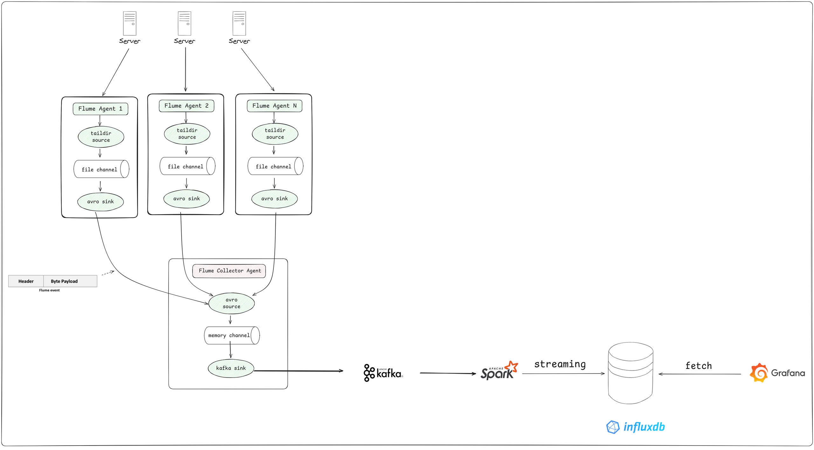
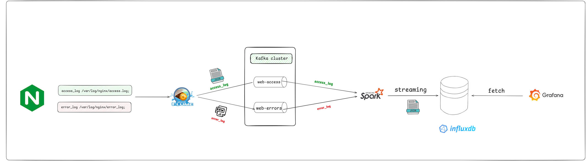

# realtime-log-analytics

Giải pháp **giám sát & phân tích log real-time** cho web servers:

* Thu thập log từ nhiều máy chủ bằng **Apache Flume**
* Vận chuyển qua **Apache Kafka**
* Phân tích real-time bằng **Apache Spark (Structured Streaming)**
* Lưu **time-series** vào **InfluxDB**
* Trực quan hóa & cảnh báo bằng **Grafana**

## ✨ Tính năng chính

* Đếm **HTTP status** (2xx/3xx/4xx/5xx), **RPS**, **latency**, **byte**
* Phát hiện **bất thường**: *IP spike*, *error surge*, *scan nhiều URL*
* **Dashboard** real-time và **Alerting** theo ngưỡng
* Thiết kế **mở rộng ngang**, **độ trễ thấp**, **chịu lỗi**

---
## 🏗️ Kiến trúc

<div align="center">
  <br/>
  <em>Hình 1. Kiến trúc tổng thể</em>
</div>

---
## 📊 Luồng dữ liệu log

<div align="center">
  <br/>
  <em>Hình 2. Luồng dữ liệu từ Nginx log đến Grafana</em>
</div>

---

## 🧰 Công nghệ sử dụng

* **Apache Flume** – thu thập log (TAILDIR, Avro/Kafka sink)
* **Apache Kafka** – message broker, buffer, decoupling producer/consumer
* **Apache Spark (Structured Streaming)** – xử lý luồng, cửa sổ thời gian
* **InfluxDB** – cơ sở dữ liệu time-series
* **Grafana** – dashboard & alerting
* **Docker / Docker Compose** – môi trường triển khai

---

## 📁 Cấu trúc thư mục

```text
realtime-log-analytics/
├─ docker-compose.yml
├─ deploy.sh
├─ .env
├─ README.md
│
├─ flume/
│  ├─ agents/
│  │  ├─ web1/flume.conf
│  │  ├─ web2/flume.conf
│  │  └─ web3/flume.conf
│  └─ collector/flume.conf
│
├─ kafka/
│  ├─ config/server.properties    # (optional, override)
│  └─ make_topics.sh              # tạo topic web-logs, partitions, retention
│
├─ spark/
│  ├─ src/main/scala/com/yourproject/LogAnalyzer.scala  # (hoặc python/)
│  ├─ conf/app.yaml              # window, watermark, thresholds
│  ├─ tests/test_parsing.scala   # (hoặc pytest nếu dùng PySpark)
│  ├─ build.sbt                  # hoặc pom.xml / requirements.txt
│  └─ Dockerfile
│
├─ influxdb/
│  ├─ config/influxdb.conf       # (optional)
│  └─ init/                      # script tạo org/bucket/token, retention
│
├─ grafana/
│  ├─ provisioning/
│  │  ├─ datasources/datasource.yml
│  │  └─ dashboards/dashboards.yml
│  └─ dashboards/
│     ├─ log-analysis-dashboard.json
│     └─ alerts.json             # (optional) export alert rules
│
├─ scripts/
│  ├─ log-generator/log_generator.py
│  ├─ gen_traffic.sh             # ab/hey/wrk
│  └─ smoke.sh                   # kiểm tra nhanh Kafka/Influx/Grafana
│
├─ data/
│  ├─ logs/web1/access.log
│  ├─ logs/web2/access.log
│  ├─ logs/web3/access.log
│  └─ state/spark/checkpoints/
│
└─ docs/
   ├─ architecture.md
   └─ runbook.md

```


---

## 👥 Chia nhiệm vụ (5 người)

* **Hùng (Flume & Deploy): 🚀**
  Phụ trách đầu vào (gom log) và triển khai dự án lên server.

  * Viết & cấu hình Flume Agents (3 server) + Aggregator/Collector (nếu dùng 2 tầng)
  * Thiết lập `TAILDIR`, `file channel`, Avro/Kafka sink, xử lý log rotate
  * Soạn `deploy.sh`, chuẩn bị `.env`, đảm bảo stack chạy ổn định
  * **Deliverables:** `flume.conf` (agents/aggregator), `deploy.sh`, hướng dẫn triển khai

* **Hảo (Kafka): 🔗**
  Đảm bảo “đường ống” vận chuyển log hoạt động tốt.

  * Cấu hình Kafka (topic `web-logs`, partitions, retention, acks)
  * Theo dõi consumer lag, runbook start/stop, script tạo topic
  * (Tùy chọn) KRaft (không ZK) cho Compose demo
  * **Deliverables:** `kafka/config/server.properties`, `make_topics.sh`, runbook Kafka

* **Hải (Spark): 🧠**
  Xây dựng “bộ não” phân tích dữ liệu.

  * Structured Streaming đọc Kafka → parse log, tính RPS & đếm status theo **window 10s**, **watermark 2m**
  * Kiểm soát throughput/backpressure, checkpointing
  * **Deliverables:** mã nguồn `spark/src/...`, build script, test parsing

* **Đôn (InfluxDB): 💾**
  Phụ trách “nhà kho” lưu trữ kết quả.

  * Thiết kế bucket/retention, measurement (`http_stats`, `anomaly`)
  * Giao tiếp từ Spark (`foreachBatch`/HTTP client), tối ưu batch write
  * **Deliverables:** `influxdb/config/influxdb.conf` (nếu cần), schema & hướng dẫn token/ORG/BUCKET

* **Nhật (Grafana): ✅**
  Phụ trách “mặt tiền” (dashboard) và quản lý chung.

  * Provision datasource & dashboards, thiết kế panel (RPS, 4xx/5xx%, Top IP/URL, bảng anomaly)
  * Thiết lập alert rules (ip\_spike, error\_surge)
  * **Deliverables:** `grafana/provisioning/*`, `dashboards/*.json`, README.md

---

### Quy ước Nhánh (Branching Convention)

* **Nhánh chính:**
    * `main`: Chứa phiên bản ổn định, sẵn sàng để deploy.
    * `develop`: Nhánh tích hợp chính. Tất cả các nhánh `feature` sẽ được merge vào đây sau khi hoàn thành.

* **Quy ước đặt tên nhánh `feature`:**
    * `feat/flume-ingestion`: **Hùng** (Flume)
    * `feat/kafka-pipeline`: **Hảo** (Kafka)
    * `feat/spark-analytics`: **Hải** (Spark)
    * `feat/influxdb-storage`: **Đôn** (InfluxDB)
    * `feat/grafana-dashboard`: **Nhật** (Grafana)
## 📚 Tài liệu chi tiết

- 📄 **Project Doc (Google Docs)**: [Tài liệu Kiến trúc – Hệ thống Giám sát & Phân tích Log Server Tập trung](https://docs.google.com/document/d/1PiGJ2ZUnI4yse3WgkTP1DghxmsFws_z2dIaZyuNYdq8/edit?hl=vi&tab=t.0#heading=h.exjyajopfano)

